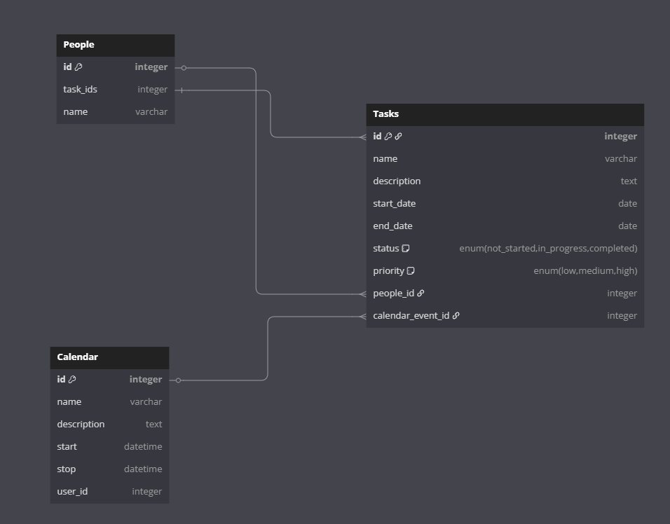

# Odoo Todo List Module

A custom Odoo module that implements a task management system with calendar integration.

## Features

- Task management with priority levels and status tracking
- People management with task assignments
- Automatic calendar event creation for tasks
- Docker-based development environment

## Data Model

The module consists of two main models with the following relationship:



- **People**: Stores information about individuals
  - Name
  - Surname
  - Birth Date
  - Tasks (One-to-many relationship with Tasks)

- **Tasks**: Stores task information
  - Name
  - Description
  - Start Date
  - End Date
  - Status (Not Started/In Progress/Completed)
  - Priority (Low/Medium/High)
  - Assigned Person (Many-to-one relationship with People)
  - Calendar Event (Automatically created/updated)

## Installation

1. Clone this repository
2. Start the Docker containers:
```sh
docker-compose up -d
```
3. Access Odoo at http://localhost:8069
4. Create a new database
5. Install the "Todo List" module from Apps

## Usage

After installation, you'll find two new menu items:

1. **Tasks**: Manage your todo items
   - Create, edit, and delete tasks
   - Assign tasks to people
   - Set priorities and status
   - Track start/end dates

2. **People**: Manage people
   - Create and manage people profiles
   - View tasks assigned to each person

## Technical Details

- Built for Odoo 18.0
- Uses PostgreSQL 15 as database
- Implements automatic calendar integration through the calendar module
- Includes proper security access rights configuration